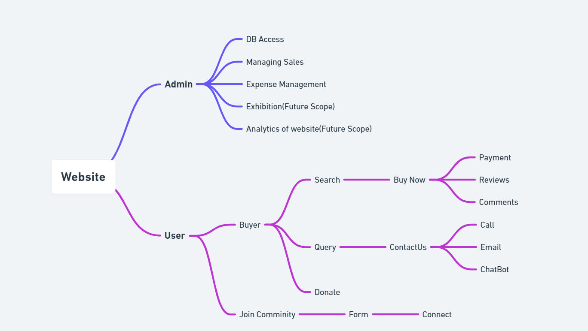

# Saksham  

## Video Link
## Presentation Link
[Presentation](https://www.canva.com/design/DAE8FQVvHkI/NHEDmiY8N494DDVBTkX55A/edit?utm_content=DAE8FQVvHkI&utm_campaign=designshare&utm_medium=link2&utm_source=sharebutton)
## Tech Stacks Used

React Js

Express Js

Node Js

MongoDB

Payment Gateway-  Razorpay

## Dependencies Used

Front End:- 

    "bootstrap": "^5.1.3",
    "react": "^17.0.2",
    "react-bootstrap": "^2.2.2",
    "react-dom": "^17.0.2",
    "react-router-dom": "^6.2.2",
    "react-scripts": "5.0.0",
    "web-vitals": "^2.1.4"

Back End:-

    "dependencies": {
    "@hapi/joi": "^17.1.1",
    "bcrypt": "^5.0.1",
    "cors": "^2.8.5",
    "cookie-parser": "^1.4.6",
    "dotenv": "^16.0.0",
    "express": "^4.17.3",
    "http-errors": "^2.0.0",
    "jsonwebtoken": "^8.5.1",
    "mongoose": "^6.2.8",
    "morgan": "^1.10.0",
    "razorpay": "^2.8.1",
    "shortid": "^2.2.16"}
## Flow Chart

## Web Flow

## To run Project

Server:- 

    run npm i
    run node server.js

Client:-

    run npm i
    run npm start
